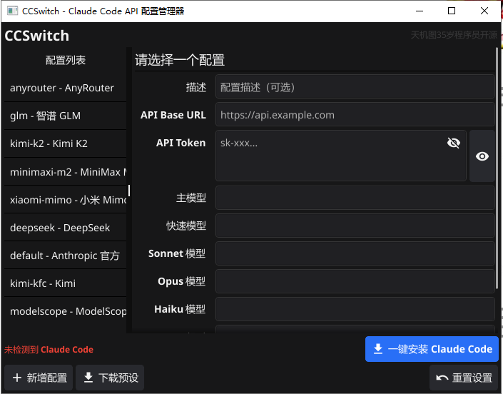

   

  <strong>新手小白也能一键安装 Claude Code 的可视化 API 配置管理器</strong>

完整文档请查看 [docs/README.md](docs/README.md)。

## 快速下载

从 [Releases](https://github.com/congxb/ccswitch-gui/releases) 下载对应系统版本：

- **Windows 10** → `ccswitch-gui.exe`
- **Windows 11** → `ccswitch-gui-win11.exe`

双击运行即可，无需安装任何运行时。
